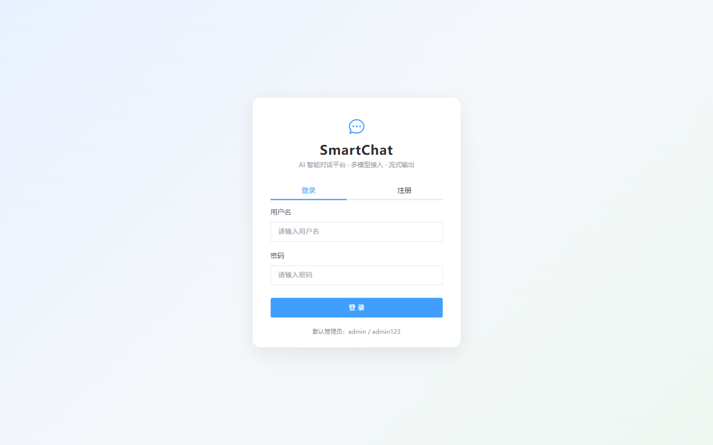
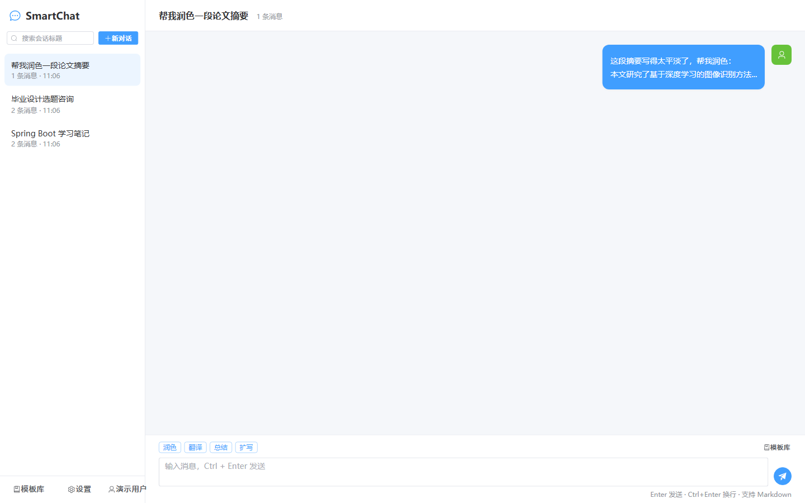
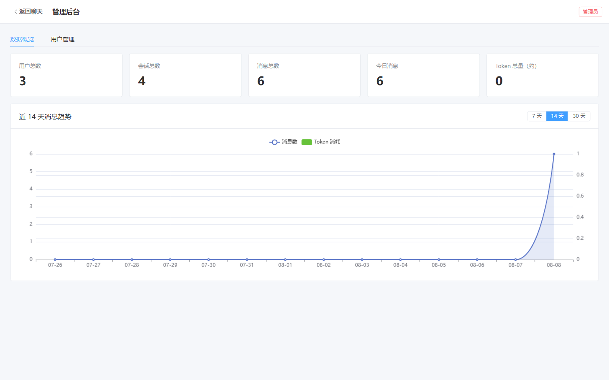
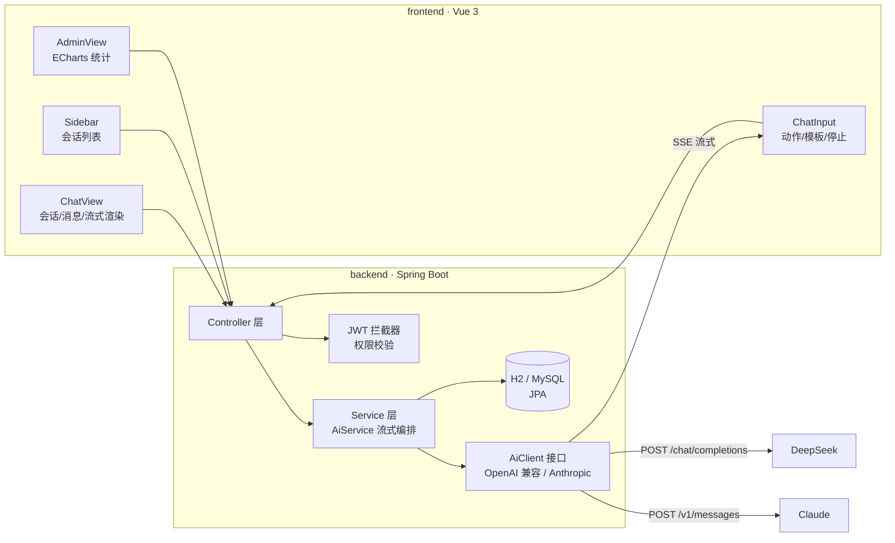

# 💬 SmartChat · AI 智能对话平台

一个开箱即用的 **Spring Boot 3 + Vue 3** 全栈 AI 对话应用：多会话管理、SSE 流式输出、快捷 AI 动作（润色 / 翻译 / 总结 / 扩写）、提示词模板库、多模型自由切换（OpenAI 兼容协议 + Anthropic Claude）、Token 用量统计与管理后台。

> 适合作为：课程设计 / 毕业设计 / AI 入门全栈项目。零外部依赖即可运行（默认 H2 内嵌数据库），也可一键切换到 MySQL。

---

## ✨ 功能特性

| 模块 | 功能 |
| --- | --- |
| 🔐 **用户系统** | 注册 / 登录（BCrypt 加密 + JWT 认证）、个人资料、修改密码、管理员禁用用户 |
| 💬 **AI 对话** | 多会话管理（搜索 / 重命名 / 删除）、SSE 流式输出、**停止生成**、**重新生成**、Markdown 渲染、复制 / 删除消息、会话标题自动生成 |
| ⚡ **快捷 AI 动作** | 一键润色、翻译、总结、扩写（自动注入提示词，无需手动切换角色） |
| 📋 **提示词模板** | 内置 6 个系统模板（翻译 / 润色 / 总结 / 代码 / 面试 / 文案）+ 用户自建模板，管理端可维护系统模板 |
| 🔌 **多模型接入** | **OpenAI 兼容协议**（DeepSeek / OpenAI / Kimi / 通义千问…）+ **Anthropic Claude** 双协议适配，每个用户可配置自己的 API Key / 模型 |
| 📊 **统计后台** | 全站概览（用户 / 会话 / 消息 / Token）、近 7/14/30 天消息趋势图（ECharts）、个人用量统计、用户管理（禁用 / 删除） |
| 🛠 **工程化** | 统一响应与全局异常处理、参数校验、JUnit 测试、GitHub Actions CI、Docker 部署（MySQL） |

## 🖼 界面预览

| 登录页 | 对话页 |
| --- | --- |
|  |  |

| 管理后台 · 数据概览 |
| --- |
|  |

## 🧱 技术栈

**后端**
- Spring Boot 3.5 / Spring MVC / Spring Data JPA
- H2 内嵌数据库（默认，零配置）· MySQL 8（可选，docker-compose 一键启动）
- JWT（jjwt）认证 + BCrypt 密码加密 + 拦截器鉴权
- SSE 流式响应（停止生成 = 中断连接，自动取消上游请求）
- Anthropic 官方 Java SDK + 自研 OpenAI 兼容流式客户端
- JUnit 5 + MockMvc 测试

**前端**
- Vue 3（Composition API + `<script setup>`）+ TypeScript
- Vite 6 · Pinia · Vue Router · Element Plus · ECharts
- marked + DOMPurify（Markdown 渲染 + XSS 过滤）

## 📐 架构



**AI 调用流程**

```
发送消息 → 保存用户消息 → 组装上下文（最近 20 条 + 系统提示词）
       → 选择客户端（用户个人配置 > 环境变量默认值）
       → SSE 流式转发增量文本 → 落库 AI 回复 + Token 用量
       → 用户点停止/断连 → 取消上游请求，丢弃半截回复
```

## 🚀 快速开始

> 需要：**JDK 17+**（本机验证于 JDK 25）、**Node.js 18+**

```bash
# 1. 启动后端（默认 8080 端口，首次会自动创建管理员与系统模板）
cd backend
./gradlew bootRun          # Windows: gradlew.bat bootRun

# 2. 启动前端（另开一个终端，默认 5173 端口，/api 自动代理到 8080）
cd frontend
npm install
npm run dev
```

打开 **http://localhost:5173** 即可使用。

| 账号 | 说明 |
| --- | --- |
| `admin / admin123` | 管理员（自动创建，可管理后台、维护系统模板） |

> 💡 数据默认保存在 `backend/data/`（H2 文件库），删除该目录即重置。

### 配置 AI

三种方式（优先级从高到低）：

1. **登录后在「设置 → AI 配置」中填写** 自己的 API Key（推荐，每个用户独立）
2. 环境变量注入（全局默认）：`AI_PROVIDER` / `AI_BASE_URL` / `AI_API_KEY` / `AI_MODEL`
3. 直接修改 `backend/src/main/resources/application.yml` 的 `smartchat.ai.*`

| 厂商 | provider | baseUrl | 默认模型 |
| --- | --- | --- | --- |
| DeepSeek | `openai` | `https://api.deepseek.com` | `deepseek-chat` |
| OpenAI | `openai` | `https://api.openai.com` | `gpt-4o-mini` |
| Kimi | `openai` | `https://api.moonshot.cn` | `moonshot-v1-8k` |
| Anthropic Claude | `anthropic` | `https://api.anthropic.com` | `claude-opus-4-8` |

> 支持 `openai` 协议的任何厂商（通义千问、GLM、本地 Ollama 等）均可通过「设置」接入。

### 生产构建（单进程部署）

```bash
cd backend && ./gradlew bootJar          # 构建后端
cd frontend && npm run build             # 构建前端（输出到 frontend/dist）
cd .. && java -jar backend/build/libs/smartchat-1.0.0.jar
```

前端构建产物会被后端自动托管（含 SPA 路由回退），访问 **http://localhost:8080** 即可。

### 切换到 MySQL

```bash
docker compose up -d                              # 启动 MySQL（smartchat/smartchat123）
SPRING_PROFILES_ACTIVE=mysql ./gradlew bootRun    # 后端以 mysql profile 启动
```

## 📁 项目结构

```
.
├── backend/                       # Spring Boot 后端
│   ├── src/main/java/com/smartchat/
│   │   ├── ai/                    # AI 客户端抽象：OpenAiClient / ClaudeClient / Factory
│   │   ├── common/                # 统一响应、全局异常、分页
│   │   ├── config/                # JWT 拦截器、CORS、种子数据、AiProperties
│   │   ├── controller/            # REST 接口（Auth/User/Conversation/Template/Stats/Admin）
│   │   ├── dto/                   # 请求/响应 DTO（Java record + 校验注解）
│   │   ├── entity/                # JPA 实体（User/Conversation/Message/Template/ApiConfig）
│   │   ├── repository/            # Spring Data JPA 仓库
│   │   ├── security/              # JWT 工具、AuthContext
│   │   └── service/               # 业务层（AiService 为核心流式编排）
│   └── src/test/java/             # JUnit + MockMvc 集成测试
├── frontend/                      # Vue 3 前端
│   └── src/
│       ├── components/            # Sidebar/MessageItem/ChatInput/TemplateDrawer...
│       ├── views/                 # LoginView / ChatView / AdminView
│       ├── api.ts                 # axios 封装 + SSE 流式客户端
│       └── store.ts               # Pinia 用户状态
├── docs/screenshots/              # 界面截图
├── docker-compose.yml             # MySQL 一键启动
└── .github/workflows/ci.yml       # CI：后端测试打包 + 前端类型检查构建
```

## 📡 API 一览

| 方法 | 路径 | 说明 |
| --- | --- | --- |
| POST | `/api/auth/register` | 注册（自动登录） |
| POST | `/api/auth/login` | 登录，返回 JWT |
| GET | `/api/auth/me` | 当前用户信息 |
| PUT | `/api/user/profile` / `/api/user/password` | 修改昵称 / 密码 |
| GET/PUT | `/api/user/api-config` | 个人 AI 配置（Key 打码回显） |
| GET/POST | `/api/conversations` | 会话列表（关键字过滤）/ 新建 |
| PUT/DELETE | `/api/conversations/{id}` | 重命名 / 删除会话 |
| GET | `/api/conversations/{id}/messages` | 消息列表 |
| POST | `/api/conversations/{id}/messages` | **发送消息（SSE 流式）** |
| POST | `/api/conversations/{id}/regenerate` | **重新生成（SSE 流式）** |
| DELETE | `/api/conversations/{id}/messages/{mid}` | 删除单条消息 |
| GET/POST/PUT/DELETE | `/api/templates` | 提示词模板 CRUD（系统模板仅管理员） |
| GET | `/api/stats/me` | 个人统计 |
| GET | `/api/stats/overview` / `/api/stats/trend` | 全站概览 / 趋势（管理员） |
| GET/PUT/DELETE | `/api/admin/users...` | 用户管理（管理员） |

SSE 事件格式：`start` → `delta` × N → `done`（携带 token 用量）/ `error`；「停止生成」= 前端中断连接。

## ✅ 测试

```bash
cd backend && ./gradlew test
```

覆盖：注册 / 登录 / 鉴权 / 重复用户名 / 错误密码、会话 CRUD、消息落库与标题自动生成、越权访问拦截等 8 个集成测试。

## 🤔 常见问题

- **`gradlew test` 报 ClassNotFoundException**：Windows 下项目路径含中文时 Gradle 测试 worker 可能无法加载类（已知的 Gradle/Windows 兼容问题）。把项目放到纯英文路径即可，CI（Linux）无此问题。
- **H2 控制台**：访问 `http://localhost:8080/h2-console`，JDBC URL 填 `jdbc:h2:file:./data/smartchat`，用户 `sa`。
- **Token 统计口径**：优先使用厂商返回的 usage；未返回时按字符数/4 估算（README 说明，非精确值）。
- **API Key 存储**：明文保存在本地数据库（个人配置），仅供本机/内网部署使用；生产环境建议用环境变量注入。

## 🗺 Roadmap

- [ ] 会话导出（Markdown / PDF）
- [ ] 流式中间结果缓存与断线重连
- [ ] WebSocket 多端同步
- [ ] 消息全文检索
- [ ] Docker 一键全栈部署镜像

## 📄 License

[MIT](LICENSE)
